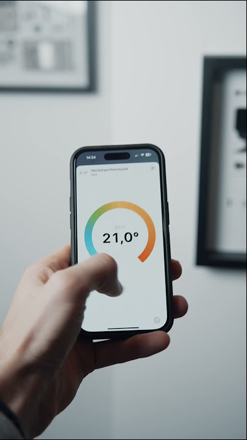

<p align="center">
  
</p>
<span align="center">

# NGBS iCON Thermostat Homebridge Plugin

[](https://www.npmjs.com/package/homebridge-ngbs-icon-thermostat) [](https://www.npmjs.com/package/homebridge-ngbs-icon-thermostat)

[](https://www.apple.com/ios/home/) 

</span>

## Supported Features

<div align="left">
  
  <b>Native HomeKit Thermostat Control for NGBS iCONs</b>
  <ul>
    <li>🌡️ Temperature Control: Adjust the target temperature of your NGBS iCON Thermostat directly from the Home app.</li>
    <li>❄️🔥 Heating and Cooling Mode: Toggle between heating and cooling modes to keep your home at the perfect temperature.</li>
    <li>🌡️ Current Temperature Display: View the current temperature in your home within the Home app.</li>
    <li>💧 Humidity Display: Monitor the humidity level in your home.</li>
    <li>🔋 Battery Status: Check the battery status of your thermostat.</li>
    <li>🗣️ Siri Integration: Use Siri voice commands to control your thermostat, such as "Hey Siri, set the temperature to 72 degrees."</li>
    <li>🤖 Automation: Create automation routines and scenes to set your thermostat based on your preferences.</li>
  </ul>
</div>

## Upcoming Features

  * Add support for manually switching between heating and cooling for supported homes
  * Add Farenheit support and Display unit switching
  * Manage timetable settings
  * More testing

<br>

## Introduction
This homebridge plugin exposes all of the NGBS iCON thermostats for native control.

**Note:** The thermostat accessory in Home app shows a single button to change the control mode. 'Auto' is the same as manual mode (the thermostat heat / cool the room to the specified temperature and maintain that). 'Off' is the same as Eco mode (the thermostats set the temperature to a low / high value, specified in the documentation of the manufacturer, to turn off the heating / cooling). Changing the temperature when set to 'Off' turns off Eco mode and starts heating / cooling if the desired value is higher / lower, than the current temperature.

## Compatibility
Although I have not personally conducted rigorous tests to verify this claim, preliminary indications suggest that the plugin exhibits potential compatibility not only with the NGBS iCON 200 series thermostats but also with the iCON 100 series devices.

## Installation
To install the homebridge plugin:
- Install the plugin through Homebridge Config UI X or manually by:
```
$ npm install -g homebridge-ngbs-icon-thermostat
```
- Configure within Homebridge Config UI X or edit `config.json` manually e.g:
```
"platforms": [
  {
    "platform": "NGBSiCONThermostat",
    "username": "YOUR_NGBS_USERNAME",
    "password": "YOUR_NGBS_PASSWORD",
    "iCONid": "YOUR_NGBS_HOME_ID"
  }
]
```
### Configuration settings
- `username` is the username for the NGBS web interface
- `password` is the password for the NGBS web interface
- `iCONid` is the id for the specific Home you want to add
The plugin will add all of the thermostats associated with the given Home.

### Troubleshooting
I will add a proper FAQ...

### Getting help
If you need help troubleshooting, create an issue and I'll try to help you fix it.

Also it's always good to restart the HomeKit app after changes made to the Homebridge configuration as HomeKit does some background cleanup to the states and presence of devices in its accessory database.
